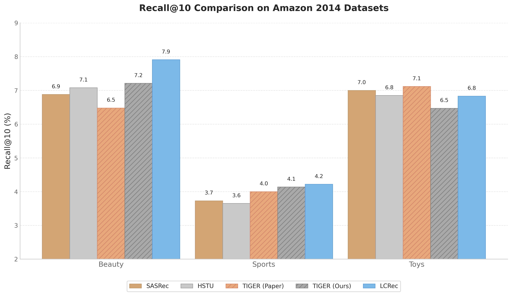

# GenRec

[](https://opensource.org/licenses/MIT)
[](https://www.python.org/downloads/)
[](https://pytorch.org/)

A Model Zoo for Generative Recommendation.

## Benchmark Results

**Validation Set Metrics**



### Amazon 2014 Beauty

| Methods | R@5 | R@10 | N@5 | N@10 |
|---------|-----|------|-----|------|
| [SASRec](https://wandb.ai/luckyqueen/sasrec_beauty_training) | 0.0469 | 0.0688 | 0.0305 | 0.0375 |
| [HSTU](https://wandb.ai/luckyqueen/hstu_beauty_training) | 0.0486 | 0.0708 | 0.0340 | 0.0412 |
| TIGER (Paper) | 0.0454 | 0.0648 | 0.0321 | 0.0384 |
| [TIGER (Ours)](https://wandb.ai/luckyqueen/amazon_beauty_tiger_training) | 0.0465 | 0.0721 | 0.0297 | 0.0378 |

### Amazon 2014 Sports

| Methods | R@5 | R@10 | N@5 | N@10 |
|---------|-----|------|-----|------|
| [SASRec](https://wandb.ai/luckyqueen/sasrec_sports_training) | 0.0249 | 0.0373 | 0.0145 | 0.0185 |
| [HSTU](https://wandb.ai/luckyqueen/hstu_sports_training) | 0.0243 | 0.0365 | 0.0168 | 0.0207 |
| TIGER (Paper) | 0.0264 | 0.0400 | 0.0181 | 0.0225 |
| [TIGER (Ours)](https://wandb.ai/luckyqueen/amazon_sports_tiger_training) | 0.0266 | 0.0414 | 0.0176 | 0.0224 |

### Amazon 2014 Toys

| Methods | R@5 | R@10 | N@5 | N@10 |
|---------|-----|------|-----|------|
| [SASRec](https://wandb.ai/luckyqueen/sasrec_toys_training) | 0.0483 | 0.0700 | 0.0304 | 0.0374 |
| [HSTU](https://wandb.ai/luckyqueen/hstu_toys_training) | 0.0504 | 0.0685 | 0.0368 | 0.0427 |
| TIGER (Paper) | 0.0521 | 0.0712 | 0.0371 | 0.0432 |
| [TIGER (Ours)](https://wandb.ai/luckyqueen/amazon_toys_tiger_training/) | 0.0420 | 0.0647 | 0.0280 | 0.0350 |

## Features

- **Multiple Models**: Implementations of SASRec, HSTU, RQVAE, TIGER, LCRec, COBRA, and NoteLLM
- **Modular Design**: Clean separation of models, data, and training logic
- **Flexible Configuration**: Gin-config based experiment management
- **Easy Extension**: Add custom datasets and models with minimal code
- **Reproducible**: Consistent evaluation metrics (Recall@K, NDCG@K)

## Models

| Model | Type | Description |
|-------|------|-------------|
| **SASRec** | Baseline | Self-Attentive Sequential Recommendation |
| **HSTU** | Baseline | Hierarchical Sequential Transduction Unit with temporal bias |
| **RQVAE** | Generative | Residual Quantized VAE for semantic ID generation |
| **TIGER** | Generative | Generative Retrieval with trie-based constrained decoding |
| **LCRec** | Generative | LLM-based recommendation with collaborative semantics |
| **COBRA** | Generative | Cascaded sparse-dense representations |

## Installation

### From Source (Recommended)

```bash
git clone https://github.com/phonism/genrec.git
cd genrec
pip install -e .
```

### Dependencies Only

```bash
pip install -r requirements.txt
```

## Quick Start

### Train RQVAE (Semantic ID Generator)

```bash
# Train on Amazon Beauty dataset
python genrec/trainers/rqvae_trainer.py config/tiger/amazon/rqvae.gin

# Train on other datasets
python genrec/trainers/rqvae_trainer.py config/tiger/amazon/rqvae.gin --split sports
```

### Train TIGER (Generative Retrieval)

```bash
# Requires pretrained RQVAE checkpoint
python genrec/trainers/tiger_trainer.py config/tiger/amazon/tiger.gin
```

### Train Baseline Models

```bash
# SASRec
python genrec/trainers/sasrec_trainer.py config/sasrec/amazon.gin

# HSTU
python genrec/trainers/hstu_trainer.py config/hstu/amazon.gin
```

## Configuration

### Dataset Selection

```bash
--split <dataset>  # beauty, sports, toys, clothing
```

### Parameter Override

```bash
--gin "param=value"
```

### Examples

```bash
# Change epochs and batch size
python genrec/trainers/tiger_trainer.py config/tiger/amazon/tiger.gin \
    --gin "train.epochs=200" \
    --gin "train.batch_size=128"

# Custom model path
python genrec/trainers/lcrec_trainer.py config/lcrec/amazon/lcrec.gin \
    --gin "MODEL_HUB_QWEN3_1_7B='/path/to/model'"
```

## Project Structure

```
genrec/
├── models/          # Model implementations (7 models)
├── modules/         # Reusable components (attention, loss, metrics)
├── trainers/        # Training scripts with Gin configuration
└── data/            # Dataset implementations
config/              # Gin configuration files
scripts/             # Utility scripts
docs/                # Documentation (English & Chinese)
```

## Documentation

Full documentation is available at [https://phonism.github.io/genrec](https://phonism.github.io/genrec)

## Contributing

We welcome contributions! Please see our [Contributing Guide](docs/en/contributing.md) for details.

## Citation

If you find this project useful, please cite:

```bibtex
@software{genrec2025,
  title = {GenRec: A Model Zoo for Generative Recommendation},
  author = {Qi Lu},
  year = {2025},
  url = {https://github.com/phonism/genrec}
}
```

## References

- [TIGER](https://arxiv.org/abs/2305.05065): Recommender Systems with Generative Retrieval
- [RQ-VAE-Recommender](https://github.com/EdoardoBotta/RQ-VAE-Recommender) by Edoardo Botta
- [LC-Rec](https://arxiv.org/abs/2311.09049): LLM-based Collaborative Recommendation
- [HSTU](https://arxiv.org/abs/2402.17152): Hierarchical Sequential Transduction Units

## License

This project is licensed under the MIT License - see the [LICENSE](LICENSE) file for details.
