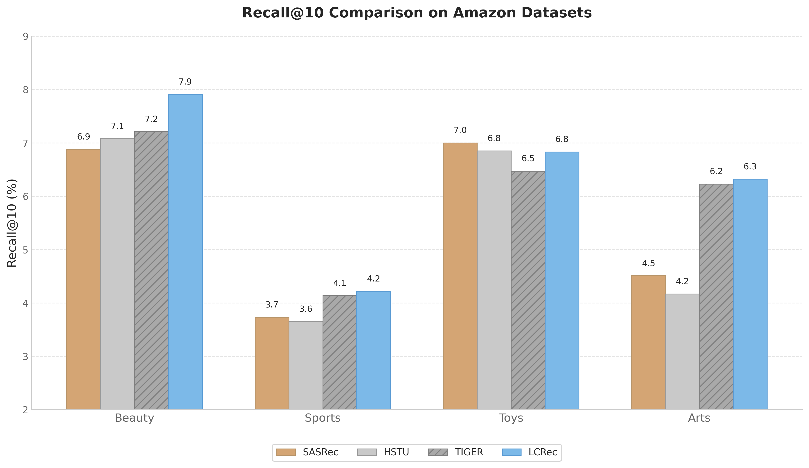

# GenRec

[](https://opensource.org/licenses/MIT)
[](https://www.python.org/downloads/)
[](https://pytorch.org/)

A Model Zoo for Generative Recommendation.

## Benchmark Results

**Metrics**



### Amazon 2014 Beauty

| Methods | R@5 | R@10 | N@5 | N@10 |
|---------|-----|------|-----|------|
| [SASRec](https://wandb.ai/luckyqueen/sasrec_beauty_training) | 0.0469 | 0.0688 | 0.0305 | 0.0375 |
| [HSTU](https://wandb.ai/luckyqueen/hstu_beauty_training) | 0.0486 | 0.0708 | 0.0340 | 0.0412 |
| TIGER (Paper) | 0.0454 | 0.0648 | 0.0321 | 0.0384 |
| [TIGER (Ours)](https://wandb.ai/luckyqueen/amazon_beauty_tiger_training) | 0.0465 | 0.0721 | 0.0297 | 0.0378 |
| [LCRec](https://wandb.ai/luckyqueen/lcrec_beauty_training) | 0.0525 | 0.0791 | 0.0352 | 0.0438 |

### Amazon 2014 Sports

| Methods | R@5 | R@10 | N@5 | N@10 |
|---------|-----|------|-----|------|
| [SASRec](https://wandb.ai/luckyqueen/sasrec_sports_training) | 0.0249 | 0.0373 | 0.0145 | 0.0185 |
| [HSTU](https://wandb.ai/luckyqueen/hstu_sports_training) | 0.0243 | 0.0365 | 0.0168 | 0.0207 |
| TIGER (Paper) | 0.0264 | 0.0400 | 0.0181 | 0.0225 |
| [TIGER (Ours)](https://wandb.ai/luckyqueen/amazon_sports_tiger_training) | 0.0266 | 0.0414 | 0.0176 | 0.0224 |
| [LCRec](https://wandb.ai/luckyqueen/lcrec_sports_training) | 0.0281 | 0.0422 | 0.0181 | 0.0226 |

### Amazon 2014 Toys

| Methods | R@5 | R@10 | N@5 | N@10 |
|---------|-----|------|-----|------|
| [SASRec](https://wandb.ai/luckyqueen/sasrec_toys_training) | 0.0483 | 0.0700 | 0.0304 | 0.0374 |
| [HSTU](https://wandb.ai/luckyqueen/hstu_toys_training) | 0.0504 | 0.0685 | 0.0368 | 0.0427 |
| TIGER (Paper) | 0.0521 | 0.0712 | 0.0371 | 0.0432 |
| [TIGER (Ours)](https://wandb.ai/luckyqueen/amazon_toys_tiger_training/) | 0.0420 | 0.0647 | 0.0280 | 0.0350 |
| [LCRec](https://wandb.ai/luckyqueen/lcrec_toys_training) | 0.0444 | 0.0683 | 0.0294 | 0.0371 |

### Amazon 2023 Arts_Crafts_and_Sewing

| Methods | R@5 | R@10 | N@5 | N@10 |
|---------|-----|------|-----|------|
| [SASRec](https://wandb.ai/luckyqueen/sasrec_amazon2023_arts_crafts_and_sewing) | 0.0314 | 0.0451 | 0.0219 | 0.0263 |
| [HSTU](https://wandb.ai/luckyqueen/hstu_amazon2023_arts_crafts_and_sewing) | 0.0289 | 0.0417 | 0.0199 | 0.0240 |
| [TIGER (Ours)](https://wandb.ai/luckyqueen/tiger_amazon2023_arts_crafts_and_sewing) | 0.0502 | 0.0623 | 0.0419 | 0.0458 |
| [LCRec](https://wandb.ai/luckyqueen/lcrec_amazon2023_arts_crafts_and_sewing) | 0.0480 | 0.0632 | 0.0362 | 0.0411 |

## Features

- **Multiple Models**: Implementations of SASRec, HSTU, RQVAE, TIGER, LCRec, COBRA, and NoteLLM
- **Multiple Datasets**: Amazon 2014 (Beauty, Sports, Toys, Clothing) and Amazon 2023 (32 categories)
- **Modular Design**: Clean separation of models, data, and training logic
- **Flexible Configuration**: Gin-config based experiment management
- **Easy Extension**: Add custom datasets and models with minimal code
- **Reproducible**: Consistent evaluation metrics (Recall@K, NDCG@K) with W&B logging

## Models

| Model | Type | Description |
|-------|------|-------------|
| **SASRec** | Baseline | Self-Attentive Sequential Recommendation |
| **HSTU** | Baseline | Hierarchical Sequential Transduction Unit with temporal bias |
| **RQVAE** | Generative | Residual Quantized VAE for semantic ID generation |
| **TIGER** | Generative | Generative Retrieval with trie-based constrained decoding |
| **LCRec** | Generative | LLM-based recommendation with collaborative semantics |
| **COBRA** | Generative | Cascaded sparse-dense representations |
| **NoteLLM** | Generative | Retrievable LLM for note recommendation (experimental) |

## Installation

### From Source (Recommended)

```bash
git clone https://github.com/phonism/genrec.git
cd genrec
pip install -e .
```

### Full Installation (with Triton, TorchRec, etc.)

```bash
pip install -e ".[full]"
```

### Dependencies Only

```bash
pip install -r requirements.txt
```

## Quick Start

### Train Baseline Models

```bash
# SASRec on Amazon 2014
python genrec/trainers/sasrec_trainer.py config/sasrec/amazon.gin --split beauty

# HSTU on Amazon 2014
python genrec/trainers/hstu_trainer.py config/hstu/amazon.gin --split beauty

# SASRec on Amazon 2023
python genrec/trainers/sasrec_trainer.py config/sasrec/amazon2023.gin

# HSTU on Amazon 2023
python genrec/trainers/hstu_trainer.py config/hstu/amazon2023.gin
```

### Train RQVAE (Semantic ID Generator)

```bash
# For TIGER pipeline
python genrec/trainers/rqvae_trainer.py config/tiger/amazon/rqvae.gin --split beauty

# For LCRec pipeline
python genrec/trainers/rqvae_trainer.py config/lcrec/amazon/rqvae.gin --split beauty

# For COBRA pipeline
python genrec/trainers/rqvae_trainer.py config/cobra/amazon/rqvae.gin --split beauty
```

### Train TIGER (Generative Retrieval)

```bash
# Requires pretrained RQVAE checkpoint
python genrec/trainers/tiger_trainer.py config/tiger/amazon/tiger.gin --split beauty

# On Amazon 2023
python genrec/trainers/tiger_trainer.py config/tiger/amazon2023/tiger.gin
```

### Train LCRec (LLM-based)

```bash
# Requires pretrained RQVAE checkpoint
python genrec/trainers/lcrec_trainer.py config/lcrec/amazon/lcrec.gin --split beauty

# On Amazon 2023
python genrec/trainers/lcrec_trainer.py config/lcrec/amazon2023/lcrec.gin
```

### Train COBRA

```bash
# Requires pretrained RQVAE checkpoint
python genrec/trainers/cobra_trainer.py config/cobra/amazon/cobra.gin --split beauty
```

## Configuration

### Dataset Selection

```bash
# Amazon 2014 datasets (via --split)
--split beauty    # Beauty
--split sports    # Sports and Outdoors
--split toys      # Toys and Games
--split clothing  # Clothing, Shoes and Jewelry

# Amazon 2023 datasets use dedicated config files
config/sasrec/amazon2023.gin
config/hstu/amazon2023.gin
config/tiger/amazon2023/tiger.gin
config/lcrec/amazon2023/lcrec.gin
```

### Parameter Override

```bash
--gin "param=value"
```

### Examples

```bash
# Change epochs and batch size
python genrec/trainers/tiger_trainer.py config/tiger/amazon/tiger.gin \
    --split beauty \
    --gin "train.epochs=200" \
    --gin "train.batch_size=128"

# Custom model path for LCRec
python genrec/trainers/lcrec_trainer.py config/lcrec/amazon/lcrec.gin \
    --split beauty \
    --gin "MODEL_HUB_QWEN3_1_7B='/path/to/model'"
```

## Project Structure

```
genrec/
├── genrec/
│   ├── models/          # Model implementations
│   │   ├── sasrec.py        # SASRec
│   │   ├── hstu.py          # HSTU
│   │   ├── rqvae.py         # RQVAE
│   │   ├── tiger.py         # TIGER
│   │   ├── lcrec.py         # LCRec
│   │   ├── cobra.py         # COBRA
│   │   └── notellm.py       # NoteLLM
│   ├── trainers/        # Training scripts
│   │   ├── sasrec_trainer.py
│   │   ├── hstu_trainer.py
│   │   ├── rqvae_trainer.py
│   │   ├── tiger_trainer.py
│   │   ├── lcrec_trainer.py
│   │   ├── cobra_trainer.py
│   │   └── trainer_utils.py
│   ├── modules/         # Reusable components
│   │   ├── transformer.py   # Transformer blocks
│   │   ├── embedding.py     # Embedding layers
│   │   ├── encoder.py       # Encoder modules
│   │   ├── metrics.py       # Recall@K, NDCG@K
│   │   ├── loss.py          # Loss functions
│   │   ├── scheduler.py     # LR schedulers
│   │   ├── kmeans.py        # K-means for RQVAE init
│   │   ├── gumbel.py        # Gumbel softmax
│   │   └── normalize.py     # Normalization layers
│   └── data/            # Dataset implementations
│       ├── amazon.py        # Amazon 2014 datasets
│       ├── amazon2023.py    # Amazon 2023 datasets (32 categories)
│       ├── amazon_sasrec.py # SASRec-specific data
│       ├── amazon_hstu.py   # HSTU-specific data
│       ├── amazon_lcrec.py  # LCRec-specific data
│       ├── amazon_cobra.py  # COBRA-specific data
│       └── p5_amazon.py     # P5-format data
├── config/              # Gin configuration files
│   ├── base.gin             # Base config
│   ├── sasrec/              # SASRec configs
│   ├── hstu/                # HSTU configs
│   ├── tiger/               # TIGER configs (amazon/, amazon2023/)
│   ├── lcrec/               # LCRec configs (amazon/, amazon2023/)
│   └── cobra/               # COBRA configs
├── scripts/             # Utility scripts
├── docs/                # Documentation (English & Chinese)
├── assets/              # Media assets
└── reference/           # Reference implementations
```

## Documentation

Full documentation is available at [https://phonism.github.io/genrec](https://phonism.github.io/genrec)

## Contributing

We welcome contributions! Please see our [Contributing Guide](docs/en/contributing.md) for details.

## Citation

If you find this project useful, please cite:

```bibtex
@software{genrec2025,
  title = {GenRec: A Model Zoo for Generative Recommendation},
  author = {Qi Lu},
  year = {2025},
  url = {https://github.com/phonism/genrec}
}
```

## References

- [SASRec](https://arxiv.org/abs/1808.09781): Self-Attentive Sequential Recommendation
- [HSTU](https://arxiv.org/abs/2402.17152): Hierarchical Sequential Transduction Units
- [TIGER](https://arxiv.org/abs/2305.05065): Recommender Systems with Generative Retrieval
- [RQ-VAE-Recommender](https://github.com/EdoardoBotta/RQ-VAE-Recommender) by Edoardo Botta
- [LC-Rec](https://arxiv.org/abs/2311.09049): LLM-based Collaborative Recommendation
- [COBRA](https://arxiv.org/abs/2503.02453): Cascaded Sparse-Dense Representations
- [NoteLLM](https://arxiv.org/abs/2403.01744): A Retrievable LLM for Note Recommendation

## License

This project is licensed under the MIT License - see the [LICENSE](LICENSE) file for details.
