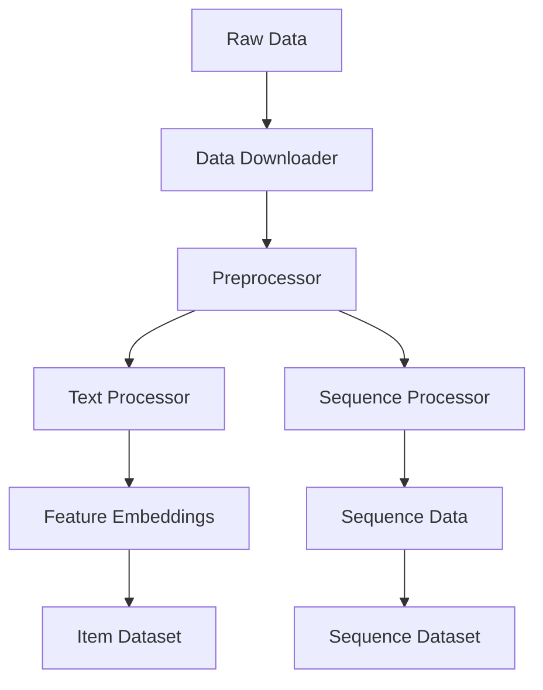

# Dataset Overview

genrec framework supports various recommendation system datasets and provides a flexible data processing pipeline.

## Supported Datasets

### P5 Amazon Dataset

P5 Amazon is a large-scale product recommendation dataset containing user reviews and product metadata.

**Features:**
- Multiple product categories (Beauty, Electronics, etc.)
- Rich textual information (title, brand, category, price)
- User interaction sequence data
- Automatic download and preprocessing

**Usage:**
```python
from genrec.data.p5_amazon import P5AmazonItemDataset

dataset = P5AmazonItemDataset(
    root="dataset/amazon",
    split="beauty",
    train_test_split="train"
)
```

## Data Processing Architecture

### Modular Design



### Configuration System

Use configuration classes to manage data processing parameters:

```python
from genrec.data.configs import P5AmazonConfig, TextEncodingConfig

config = P5AmazonConfig(
    root_dir="dataset/amazon",
    split="beauty",
    text_config=TextEncodingConfig(
        encoder_model="sentence-transformers/sentence-t5-xl",
        template="Title: {title}; Brand: {brand}"
    )
)
```

## Data Processing Pipeline

### 1. Data Download
- Automatic dataset download from cloud
- Extract and organize files
- Verify data integrity

### 2. Preprocessing
- Data cleaning and normalization
- Handle missing values
- ID mapping and re-encoding

### 3. Feature Extraction
- Text feature encoding
- Categorical feature processing
- Numerical feature normalization

### 4. Sequence Generation
- Build user interaction sequences
- Temporal splitting (train/validation/test)
- Sequence padding and truncation

## Custom Datasets

To add new datasets, inherit from base class and implement necessary methods:

```python
from genrec.data.base_dataset import BaseRecommenderDataset

class MyDataset(BaseRecommenderDataset):
    def download(self):
        # Implement data download logic
        pass
        
    def load_raw_data(self):
        # Load raw data
        return {"items": items_df, "interactions": interactions_df}
        
    def preprocess_data(self, raw_data):
        # Data preprocessing
        return processed_data
        
    def extract_items(self, processed_data):
        return processed_data["items"]
        
    def extract_interactions(self, processed_data):
        return processed_data["interactions"]
```

## Performance Optimization

### Caching Mechanism
- Text encoding result caching
- Preprocessed data caching  
- Smart cache invalidation

### Memory Management
- Lazy loading of large datasets
- Batch data processing
- Memory usage monitoring

### Parallel Processing
- Multi-process data loading
- Parallel text encoding
- Distributed preprocessing

## Best Practices

1. **Data Validation**: Always validate data quality and integrity
2. **Version Control**: Track dataset versions and changes
3. **Documentation**: Detailed recording of data processing steps
4. **Performance Monitoring**: Monitor data loading and processing performance

## Common Issues

**Q: How to handle large-scale datasets?**
A: Use chunked loading, caching, and parallel processing

**Q: How to add new text encoders?**
A: Inherit from TextProcessor class and implement custom encoding logic

**Q: How to handle different data formats?**
A: Create custom data loaders and preprocessing pipelines