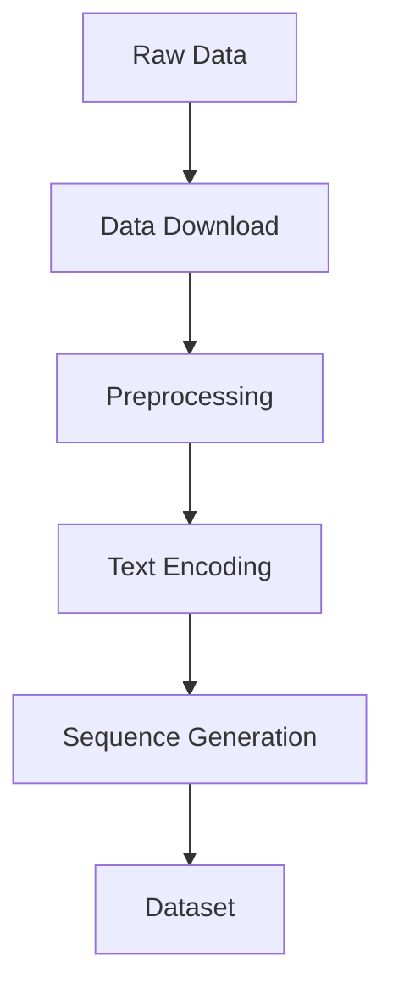
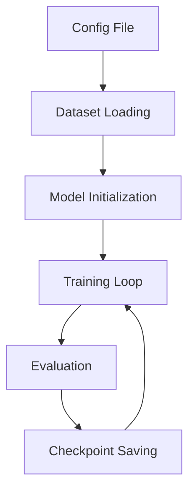

# Getting Started

This guide will help you quickly get started with the genrec framework.

## Prerequisites

- Python 3.8 or higher
- CUDA 11.0+ (if using GPU)
- 8GB+ GPU memory (recommended)

## Installation

### 1. Clone the Repository

```bash
git clone https://github.com/phonism/genrec.git
cd genrec
```

### 2. Install Dependencies

```bash
pip install -r requirements.txt
```

### 3. Prepare Data

Download the P5 Amazon dataset:

```bash
# Data will be automatically downloaded to dataset/amazon directory
mkdir -p dataset/amazon
```

## First Experiment: Training RQVAE

### 1. Check Configuration File

```bash
cat config/rqvae/p5_amazon.gin
```

Key configuration parameters:
- `train.iterations=400000`: Number of training iterations
- `train.batch_size=64`: Batch size
- `train.learning_rate=0.0005`: Learning rate
- `train.dataset_folder="dataset/amazon"`: Dataset path

### 2. Start Training

```bash
python genrec/trainers/rqvae_trainer.py config/rqvae/p5_amazon.gin
```

During training you'll see:
- Automatic data download and preprocessing
- Text feature encoding progress
- Training loss and metrics
- Model checkpoint saving

### 3. Monitor Training

If Weights & Biases logging is enabled:

```bash
# Set in configuration file
train.wandb_logging=True
train.wandb_project="your_project_name"
```

Visit [wandb.ai](https://wandb.ai) to view training progress.

## Second Experiment: Training TIGER

### 1. Ensure RQVAE is Trained

TIGER requires a pre-trained RQVAE model to generate semantic IDs:

```bash
# Check if RQVAE checkpoint exists
ls out/rqvae/p5_amazon/beauty/checkpoint_*.pt
```

### 2. Configure TIGER

Edit `config/tiger/p5_amazon.gin`:

```gin
train.pretrained_rqvae_path="./out/rqvae/p5_amazon/beauty/checkpoint_299999.pt"
```

### 3. Start Training

```bash
python genrec/trainers/tiger_trainer.py config/tiger/p5_amazon.gin
```

## Understanding the Framework Structure

### Data Processing Pipeline



### Model Training Flow



## Custom Configuration

### Creating Custom Configuration

```gin
# my_config.gin
import genrec.data.p5_amazon
import genrec.models.rqvae

# Custom parameters
train.batch_size=32
train.learning_rate=0.001
train.vae_hidden_dims=[256, 128, 64]

# Use custom data path
train.dataset_folder="path/to/my/data"
```

### Using Custom Configuration

```bash
python genrec/trainers/rqvae_trainer.py my_config.gin
```

## Model Evaluation

### RQVAE Evaluation

```python
from genrec.models.rqvae import RqVae
from genrec.data.p5_amazon import P5AmazonItemDataset

# Load model
model = RqVae.load_from_checkpoint("path/to/checkpoint.pt")

# Load test data
test_dataset = P5AmazonItemDataset(
    root="dataset/amazon", 
    train_test_split="eval"
)

# Evaluate reconstruction quality
reconstruction_loss = model.evaluate(test_dataset)
```

### TIGER Evaluation

```python
from genrec.models.tiger import Tiger
from genrec.modules.metrics import TopKAccumulator

# Load model
model = Tiger.load_from_checkpoint("path/to/checkpoint.pt")

# Calculate Recall@K
metrics = TopKAccumulator(k=10)
recall = metrics.compute_recall(model, test_dataloader)
```

## Common Issues

### Q: Out of memory?

A: Adjust these parameters:
```gin
train.batch_size=16  # Reduce batch size
train.vae_hidden_dims=[256, 128]  # Reduce model size
```

### Q: Training too slow?

A: Optimization suggestions:
- Use larger batch sizes
- Enable mixed precision training
- Use multi-GPU training

### Q: How to add new datasets?

A: Refer to the [Custom Dataset Guide](dataset/custom.md)

## Next Steps

- Learn about [Model Architectures](models/rqvae.md)
- Understand [Dataset Processing](dataset/overview.md)
- Check [API Documentation](api/index.md)
- Explore [Advanced Examples](examples.md)