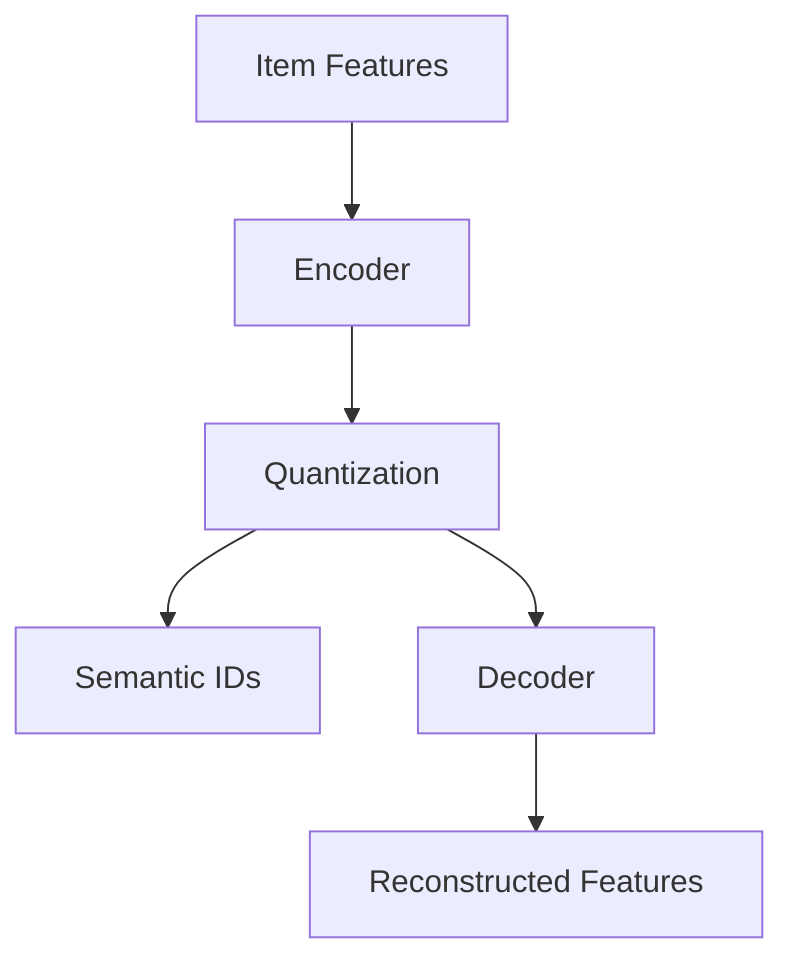

# RQVAE Model

Residual Quantized Variational Autoencoder (RQVAE) is a deep learning model for learning semantic representations of items in recommender systems.

## Architecture

### Core Concept

RQVAE learns to encode item features into discrete semantic IDs through:
- **Encoder**: Maps item features to continuous latent space
- **Quantizer**: Discretizes continuous representations into semantic IDs
- **Decoder**: Reconstructs original features from semantic IDs



### Model Components

#### 1. Encoder Network

```python
class Encoder(nn.Module):
    """Feature encoder network"""
    def __init__(self, input_dim, hidden_dim, latent_dim):
        super().__init__()
        self.layers = nn.Sequential(
            nn.Linear(input_dim, hidden_dim),
            nn.ReLU(),
            nn.Linear(hidden_dim, hidden_dim),
            nn.ReLU(),
            nn.Linear(hidden_dim, latent_dim)
        )
    
    def forward(self, features):
        return self.layers(features)
```

#### 2. Vector Quantization

```python
class VectorQuantizer(nn.Module):
    """Vector quantization layer"""
    def __init__(self, num_embeddings, embedding_dim, commitment_cost=0.25):
        super().__init__()
        self.embedding_dim = embedding_dim
        self.num_embeddings = num_embeddings
        self.commitment_cost = commitment_cost
        
        self.embeddings = nn.Embedding(num_embeddings, embedding_dim)
        
    def forward(self, inputs):
        # Calculate distances
        distances = torch.cdist(inputs, self.embeddings.weight)
        
        # Get closest embeddings
        encoding_indices = torch.argmin(distances, dim=-1)
        quantized = self.embeddings(encoding_indices)
        
        # Calculate losses
        commitment_loss = F.mse_loss(quantized.detach(), inputs)
        embedding_loss = F.mse_loss(quantized, inputs.detach())
        
        quantized = inputs + (quantized - inputs).detach()
        
        return quantized, commitment_loss, embedding_loss, encoding_indices
```

#### 3. Decoder Network

```python
class Decoder(nn.Module):
    """Feature reconstruction decoder"""
    def __init__(self, latent_dim, hidden_dim, output_dim):
        super().__init__()
        self.layers = nn.Sequential(
            nn.Linear(latent_dim, hidden_dim),
            nn.ReLU(),
            nn.Linear(hidden_dim, hidden_dim),
            nn.ReLU(),
            nn.Linear(hidden_dim, output_dim)
        )
    
    def forward(self, latent):
        return self.layers(latent)
```

## Training Process

### Loss Function

RQVAE uses a combination of reconstruction loss and quantization losses:

```python
def compute_loss(self, features, reconstructed, commitment_loss, embedding_loss):
    # Reconstruction loss
    recon_loss = F.mse_loss(reconstructed, features)
    
    # Total loss
    total_loss = (
        recon_loss + 
        self.commitment_cost * commitment_loss + 
        embedding_loss
    )
    
    return {
        'total_loss': total_loss,
        'reconstruction_loss': recon_loss,
        'commitment_loss': commitment_loss,
        'embedding_loss': embedding_loss
    }
```

### Training Loop

```python
def train_step(model, batch, optimizer):
    optimizer.zero_grad()
    
    # Forward pass
    features = batch['features']
    reconstructed, commitment_loss, embedding_loss, sem_ids = model(features)
    
    # Compute losses
    losses = model.compute_loss(features, reconstructed, commitment_loss, embedding_loss)
    
    # Backward pass
    losses['total_loss'].backward()
    optimizer.step()
    
    return losses, sem_ids
```

## Semantic ID Generation

### Item to Semantic ID Mapping

```python
def generate_semantic_ids(model, item_features):
    """Generate semantic IDs for items"""
    model.eval()
    
    with torch.no_grad():
        encoded = model.encoder(item_features)
        _, _, _, sem_ids = model.quantizer(encoded)
    
    return sem_ids
```

### Batch Processing

```python
def batch_generate_semantic_ids(model, dataloader):
    """Generate semantic IDs for entire dataset"""
    model.eval()
    all_sem_ids = []
    
    with torch.no_grad():
        for batch in dataloader:
            features = batch['features']
            sem_ids = model.generate_semantic_ids(features)
            all_sem_ids.append(sem_ids)
    
    return torch.cat(all_sem_ids, dim=0)
```

## Evaluation Metrics

### Reconstruction Quality

```python
def compute_reconstruction_metrics(original, reconstructed):
    """Compute reconstruction quality metrics"""
    mse = F.mse_loss(reconstructed, original)
    mae = F.l1_loss(reconstructed, original)
    
    # Cosine similarity
    cos_sim = F.cosine_similarity(original, reconstructed, dim=-1).mean()
    
    return {
        'mse': mse.item(),
        'mae': mae.item(),
        'cosine_similarity': cos_sim.item()
    }
```

### Quantization Metrics

```python
def compute_quantization_metrics(model, dataloader):
    """Compute quantization quality metrics"""
    model.eval()
    
    total_perplexity = 0
    total_usage = torch.zeros(model.quantizer.num_embeddings)
    
    with torch.no_grad():
        for batch in dataloader:
            features = batch['features']
            _, _, _, encoding_indices = model(features)
            
            # Compute perplexity
            avg_probs = torch.bincount(encoding_indices.flatten(), 
                                     minlength=model.quantizer.num_embeddings).float()
            avg_probs = avg_probs / avg_probs.sum()
            perplexity = torch.exp(-torch.sum(avg_probs * torch.log(avg_probs + 1e-10)))
            
            total_perplexity += perplexity
            total_usage += avg_probs
    
    # Usage statistics
    active_codes = (total_usage > 0).sum().item()
    usage_entropy = -torch.sum(total_usage * torch.log(total_usage + 1e-10))
    
    return {
        'perplexity': total_perplexity / len(dataloader),
        'active_codes': active_codes,
        'usage_entropy': usage_entropy.item()
    }
```

## Model Optimization

### Learning Rate Scheduling

```python
class WarmupScheduler:
    """Warmup learning rate scheduler"""
    def __init__(self, optimizer, warmup_steps, max_lr):
        self.optimizer = optimizer
        self.warmup_steps = warmup_steps
        self.max_lr = max_lr
        self.step_count = 0
    
    def step(self):
        self.step_count += 1
        if self.step_count <= self.warmup_steps:
            lr = self.max_lr * self.step_count / self.warmup_steps
        else:
            lr = self.max_lr * 0.95 ** ((self.step_count - self.warmup_steps) // 1000)
        
        for param_group in self.optimizer.param_groups:
            param_group['lr'] = lr
```

### Gradient Clipping

```python
def train_with_gradient_clipping(model, dataloader, optimizer, max_grad_norm=1.0):
    """Training with gradient clipping"""
    for batch in dataloader:
        optimizer.zero_grad()
        
        # Forward pass
        losses, _ = model.train_step(batch)
        
        # Backward pass with gradient clipping
        losses['total_loss'].backward()
        torch.nn.utils.clip_grad_norm_(model.parameters(), max_grad_norm)
        
        optimizer.step()
```

## Advanced Features

### Multiple Quantizers

```python
class MultiQuantizer(nn.Module):
    """Multiple quantization layers"""
    def __init__(self, num_quantizers, num_embeddings, embedding_dim):
        super().__init__()
        self.quantizers = nn.ModuleList([
            VectorQuantizer(num_embeddings, embedding_dim)
            for _ in range(num_quantizers)
        ])
    
    def forward(self, inputs):
        quantized_list = []
        commitment_losses = []
        embedding_losses = []
        sem_ids_list = []
        
        current_input = inputs
        for quantizer in self.quantizers:
            quantized, commitment_loss, embedding_loss, sem_ids = quantizer(current_input)
            
            quantized_list.append(quantized)
            commitment_losses.append(commitment_loss)
            embedding_losses.append(embedding_loss)
            sem_ids_list.append(sem_ids)
            
            # Residual connection
            current_input = current_input - quantized.detach()
        
        # Combine quantized representations
        final_quantized = sum(quantized_list)
        total_commitment_loss = sum(commitment_losses)
        total_embedding_loss = sum(embedding_losses)
        
        return final_quantized, total_commitment_loss, total_embedding_loss, sem_ids_list
```

### Exponential Moving Average

```python
class EMAQuantizer(VectorQuantizer):
    """Quantizer with exponential moving average updates"""
    def __init__(self, num_embeddings, embedding_dim, decay=0.99):
        super().__init__(num_embeddings, embedding_dim)
        self.decay = decay
        self.register_buffer('cluster_size', torch.zeros(num_embeddings))
        self.register_buffer('embed_avg', self.embeddings.weight.clone())
    
    def forward(self, inputs):
        quantized, commitment_loss, _, encoding_indices = super().forward(inputs)
        
        if self.training:
            # Update EMA
            encodings = F.one_hot(encoding_indices, self.num_embeddings).float()
            self.cluster_size.mul_(self.decay).add_(
                encodings.sum(0), alpha=1 - self.decay
            )
            
            embed_sum = encodings.transpose(0, 1) @ inputs
            self.embed_avg.mul_(self.decay).add_(embed_sum, alpha=1 - self.decay)
            
            # Normalize
            n = self.cluster_size.sum()
            cluster_size = (
                (self.cluster_size + 1e-5) / (n + self.num_embeddings * 1e-5) * n
            )
            embed_normalized = self.embed_avg / cluster_size.unsqueeze(1)
            self.embeddings.weight.data.copy_(embed_normalized)
        
        return quantized, commitment_loss, torch.tensor(0.0), encoding_indices
```

## Practical Applications

### Item Similarity

```python
def compute_item_similarity(model, item_features_1, item_features_2):
    """Compute similarity between items using semantic IDs"""
    sem_ids_1 = model.generate_semantic_ids(item_features_1)
    sem_ids_2 = model.generate_semantic_ids(item_features_2)
    
    # Exact match similarity
    exact_match = (sem_ids_1 == sem_ids_2).float().mean()
    
    # Embedding space similarity
    embed_1 = model.quantizer.embeddings(sem_ids_1)
    embed_2 = model.quantizer.embeddings(sem_ids_2)
    cosine_sim = F.cosine_similarity(embed_1, embed_2, dim=-1).mean()
    
    return {
        'exact_match': exact_match.item(),
        'embedding_similarity': cosine_sim.item()
    }
```

### Recommendation System Integration

```python
class RQVAERecommender:
    """RQVAE-based recommender system"""
    def __init__(self, rqvae_model):
        self.rqvae = rqvae_model
        self.rqvae.eval()
    
    def encode_items(self, item_features):
        """Encode items to semantic IDs"""
        return self.rqvae.generate_semantic_ids(item_features)
    
    def find_similar_items(self, query_item_features, item_database, top_k=10):
        """Find similar items using semantic IDs"""
        query_sem_ids = self.encode_items(query_item_features)
        db_sem_ids = self.encode_items(item_database)
        
        # Compute similarities
        similarities = []
        for i, db_sem_id in enumerate(db_sem_ids):
            sim = (query_sem_ids == db_sem_id).float().mean()
            similarities.append((i, sim.item()))
        
        # Sort and return top-k
        similarities.sort(key=lambda x: x[1], reverse=True)
        return similarities[:top_k]
```

RQVAE provides a powerful foundation for learning discrete semantic representations that can be effectively used in generative recommendation models like TIGER.