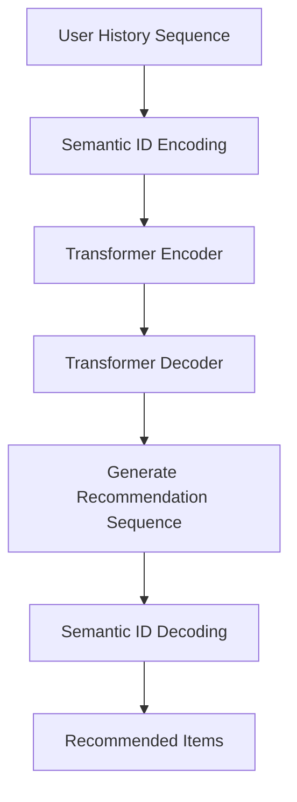

# TIGER Model

TIGER (Recommender Systems with Generative Retrieval) is a Transformer-based generative recommendation model that performs item recommendation through sequence modeling.

## Model Architecture

### Core Concept

TIGER transforms recommendation into a sequence generation problem:
- **Input**: User interaction history (semantic ID sequence)
- **Output**: Recommended item semantic ID sequence



### Model Components

#### 1. Embedding Layer

```python
class SemIdEmbedding(nn.Module):
    """Semantic ID embedding layer"""
    def __init__(self, num_embeddings, embedding_dim, sem_id_dim=3):
        super().__init__()
        self.sem_id_dim = sem_id_dim
        self.embedding = nn.Embedding(num_embeddings, embedding_dim)
        
    def forward(self, sem_ids):
        # sem_ids: (batch_size, seq_len, sem_id_dim)
        embedded = self.embedding(sem_ids)
        return embedded.mean(dim=-2)  # Aggregate semantic ID dimension
```

#### 2. Transformer Architecture

```python
class TransformerEncoderDecoder(nn.Module):
    """Transformer encoder-decoder"""
    def __init__(self, config):
        super().__init__()
        
        # Encoder
        encoder_layer = TransformerEncoderLayer(
            d_model=config.embedding_dim,
            nhead=config.num_heads,
            dim_feedforward=config.attn_dim,
            dropout=config.dropout
        )
        self.encoder = TransformerEncoder(encoder_layer, config.n_layers)
        
        # Decoder  
        decoder_layer = TransformerDecoderLayer(
            d_model=config.embedding_dim,
            nhead=config.num_heads,
            dim_feedforward=config.attn_dim,
            dropout=config.dropout
        )
        self.decoder = TransformerDecoder(decoder_layer, config.n_layers)
```

#### 3. Constrained Generation

TIGER uses Trie data structure to constrain generation:

```python
class TrieNode(defaultdict):
    """Trie node"""
    def __init__(self):
        super().__init__(TrieNode)
        self.is_end = False

def build_trie(valid_item_ids):
    """Build Trie of valid item IDs"""
    root = TrieNode()
    for seq in valid_item_ids.tolist():
        node = root
        for token in seq:
            node = node[token]
        node.is_end = True
    return root
```

## Semantic ID Mapping

### From Items to Semantic IDs

TIGER uses pretrained RQVAE to map item features to semantic IDs:

```python
# Item features -> Semantic IDs
item_features = torch.tensor([...])  # (768,)
rqvae_output = rqvae(item_features)
semantic_ids = rqvae_output.sem_ids  # (3,) Three semantic IDs
```

### Semantic ID Sequences

User interaction history is converted to semantic ID sequences:

```python
user_history = [item1, item2, item3, ...]
semantic_sequence = []

for item_id in user_history:
    item_sem_ids = rqvae.get_semantic_ids(item_features[item_id])
    semantic_sequence.extend(item_sem_ids.tolist())

# Result: [id1, id2, id3, id4, id5, id6, ...]
```

## Training Process

### Data Preparation

```python
class SeqData(NamedTuple):
    """Sequence data format"""
    user_id: int
    item_ids: List[int]      # Input sequence (semantic IDs)
    target_ids: List[int]    # Target sequence (semantic IDs)
```

### Loss Function

Uses cross-entropy loss for sequence modeling:

```python
def compute_loss(logits, target_ids, mask):
    """Compute sequence modeling loss"""
    # logits: (batch_size, seq_len, vocab_size)
    # target_ids: (batch_size, seq_len)
    # mask: (batch_size, seq_len)
    
    loss_fn = nn.CrossEntropyLoss(ignore_index=-1)
    
    # Reshape to 2D
    logits_flat = logits.view(-1, logits.size(-1))
    target_flat = target_ids.view(-1)
    
    # Compute loss
    loss = loss_fn(logits_flat, target_flat)
    
    return loss
```

### Training Loop

```python
def train_step(model, batch, optimizer):
    """Single training step"""
    optimizer.zero_grad()
    
    # Forward pass
    user_ids = batch["user_input_ids"]
    item_ids = batch["item_input_ids"] 
    target_ids = batch["target_input_ids"]
    
    logits = model(user_ids, item_ids)
    
    # Compute loss
    loss = compute_loss(logits, target_ids, batch["seq_mask"])
    
    # Backward pass
    loss.backward()
    optimizer.step()
    
    return loss.item()
```

## Inference Process

### Generative Recommendation

```python
def generate_recommendations(model, user_sequence, max_length=10):
    """Generate recommendation sequence"""
    model.eval()
    
    with torch.no_grad():
        # Encode user sequence
        encoded = model.encode_sequence(user_sequence)
        
        # Autoregressive generation
        generated = []
        current_input = encoded
        
        for _ in range(max_length):
            # Predict next token
            logits = model.decode_step(current_input)
            next_token = torch.argmax(logits, dim=-1)
            
            generated.append(next_token.item())
            
            # Update input
            current_input = torch.cat([current_input, next_token.unsqueeze(0)])
    
    return generated
```

### Trie-Constrained Generation

```python
def generate_with_trie_constraint(model, user_sequence, trie, max_length=10):
    """Generation with Trie constraints"""
    model.eval()
    
    generated = []
    current_node = trie
    
    with torch.no_grad():
        for step in range(max_length):
            # Get valid next tokens
            valid_tokens = list(current_node.keys())
            if not valid_tokens:
                break
                
            # Predict and constrain
            logits = model.decode_step(user_sequence + generated)
            masked_logits = mask_invalid_tokens(logits, valid_tokens)
            
            next_token = torch.argmax(masked_logits, dim=-1).item()
            generated.append(next_token)
            
            # Update Trie position
            current_node = current_node[next_token]
            
            # Check if complete item ID
            if current_node.is_end:
                break
    
    return generated
```

## Evaluation Metrics

### Top-K Recommendation Metrics

```python
def compute_recall_at_k(predictions, targets, k=10):
    """Compute Recall@K"""
    recall_scores = []
    
    for pred, target in zip(predictions, targets):
        # Get top-k predictions
        top_k_pred = set(pred[:k])
        target_set = set(target)
        
        # Compute recall
        if len(target_set) > 0:
            recall = len(top_k_pred & target_set) / len(target_set)
            recall_scores.append(recall)
    
    return np.mean(recall_scores)

def compute_ndcg_at_k(predictions, targets, k=10):
    """Compute NDCG@K"""
    ndcg_scores = []
    
    for pred, target in zip(predictions, targets):
        # Compute DCG
        dcg = 0
        for i, item in enumerate(pred[:k]):
            if item in target:
                dcg += 1 / np.log2(i + 2)  # +2 because log2(1)=0
        
        # Compute IDCG
        idcg = sum(1 / np.log2(i + 2) for i in range(min(len(target), k)))
        
        # Compute NDCG
        ndcg = dcg / idcg if idcg > 0 else 0
        ndcg_scores.append(ndcg)
    
    return np.mean(ndcg_scores)
```

### Diversity Metrics

```python
def compute_diversity(recommendations):
    """Compute recommendation diversity"""
    all_items = set()
    for rec_list in recommendations:
        all_items.update(rec_list)
    
    # Item coverage
    coverage = len(all_items) / total_items
    
    # Gini coefficient
    item_counts = defaultdict(int)
    for rec_list in recommendations:
        for item in rec_list:
            item_counts[item] += 1
    
    counts = list(item_counts.values())
    gini = compute_gini_coefficient(counts)
    
    return {"coverage": coverage, "gini": gini}
```

## Model Optimization

### Positional Encoding

```python
class PositionalEncoding(nn.Module):
    """Positional encoding"""
    def __init__(self, d_model, max_seq_length=5000):
        super().__init__()
        
        pe = torch.zeros(max_seq_length, d_model)
        position = torch.arange(0, max_seq_length, dtype=torch.float).unsqueeze(1)
        
        div_term = torch.exp(torch.arange(0, d_model, 2).float() * 
                           (-math.log(10000.0) / d_model))
        
        pe[:, 0::2] = torch.sin(position * div_term)
        pe[:, 1::2] = torch.cos(position * div_term)
        
        self.register_buffer('pe', pe.unsqueeze(0))
    
    def forward(self, x):
        return x + self.pe[:, :x.size(1)]
```

### Attention Mechanism Optimization

```python
class MultiHeadAttention(nn.Module):
    """Optimized multi-head attention"""
    def __init__(self, d_model, num_heads, dropout=0.1):
        super().__init__()
        assert d_model % num_heads == 0
        
        self.d_k = d_model // num_heads
        self.num_heads = num_heads
        
        self.w_q = nn.Linear(d_model, d_model)
        self.w_k = nn.Linear(d_model, d_model)
        self.w_v = nn.Linear(d_model, d_model)
        self.w_o = nn.Linear(d_model, d_model)
        
        self.dropout = nn.Dropout(dropout)
        
    def forward(self, query, key, value, mask=None):
        batch_size = query.size(0)
        
        # Linear transformations
        Q = self.w_q(query).view(batch_size, -1, self.num_heads, self.d_k).transpose(1, 2)
        K = self.w_k(key).view(batch_size, -1, self.num_heads, self.d_k).transpose(1, 2)
        V = self.w_v(value).view(batch_size, -1, self.num_heads, self.d_k).transpose(1, 2)
        
        # Scaled dot-product attention
        attention, weights = scaled_dot_product_attention(Q, K, V, mask, self.dropout)
        
        # Concatenate heads
        attention = attention.transpose(1, 2).contiguous().view(
            batch_size, -1, self.num_heads * self.d_k
        )
        
        output = self.w_o(attention)
        return output, weights
```

## Advanced Features

### User Behavior Modeling

```python
class UserBehaviorEncoder(nn.Module):
    """User behavior encoder"""
    def __init__(self, config):
        super().__init__()
        
        # Time encoding
        self.time_encoder = nn.Linear(1, config.embedding_dim)
        
        # Behavior type encoding
        self.behavior_embedding = nn.Embedding(
            config.num_behavior_types, 
            config.embedding_dim
        )
        
    def forward(self, sequences, timestamps, behavior_types):
        # Sequence encoding
        seq_encoded = self.item_encoder(sequences)
        
        # Time encoding
        time_encoded = self.time_encoder(timestamps.unsqueeze(-1))
        
        # Behavior encoding
        behavior_encoded = self.behavior_embedding(behavior_types)
        
        # Fuse features
        combined = seq_encoded + time_encoded + behavior_encoded
        
        return combined
```

### Cold Start Handling

```python
class ColdStartHandler:
    """Cold start handler"""
    
    def __init__(self, model, item_features):
        self.model = model
        self.item_features = item_features
        
    def recommend_for_new_user(self, user_profile, k=10):
        """Recommend for new user"""
        # Find similar items based on user profile
        similar_items = self.find_similar_items(user_profile)
        
        # Use item features for recommendation
        recommendations = self.model.recommend_by_content(similar_items, k)
        
        return recommendations
    
    def recommend_new_item(self, item_features, k=10):
        """Recommend new item"""
        # Find feature-similar existing items
        similar_existing = self.find_similar_existing_items(item_features)
        
        # Recommend to users who liked similar items
        target_users = self.get_users_who_liked(similar_existing)
        
        return target_users[:k]
```

## Practical Applications

### Online Service

```python
class TIGERRecommendationService:
    """TIGER recommendation service"""
    
    def __init__(self, model_path, device='cuda'):
        self.model = Tiger.load_from_checkpoint(model_path)
        self.model.to(device)
        self.model.eval()
        self.device = device
        
    def get_recommendations(self, user_id, user_history, k=10):
        """Get recommendation results"""
        # Preprocess user history
        semantic_sequence = self.preprocess_user_history(user_history)
        
        # Generate recommendations
        with torch.no_grad():
            recommendations = self.model.generate_recommendations(
                semantic_sequence, max_length=k
            )
        
        # Post-process: semantic IDs -> item IDs
        item_recommendations = self.semantic_to_items(recommendations)
        
        return item_recommendations
    
    def batch_recommend(self, user_requests):
        """Batch recommendation"""
        batch_results = []
        
        for user_id, user_history in user_requests:
            recommendations = self.get_recommendations(user_id, user_history)
            batch_results.append((user_id, recommendations))
        
        return batch_results
```

### A/B Testing Support

```python
class ABTestingFramework:
    """A/B testing framework"""
    
    def __init__(self, model_a, model_b):
        self.model_a = model_a  # Control group model
        self.model_b = model_b  # Experiment group model
        
    def recommend_with_ab_test(self, user_id, user_history, test_group=None):
        """A/B test recommendation"""
        if test_group is None:
            # Random assignment
            test_group = 'A' if hash(user_id) % 2 == 0 else 'B'
        
        if test_group == 'A':
            return self.model_a.recommend(user_history), 'A'
        else:
            return self.model_b.recommend(user_history), 'B'
    
    def collect_metrics(self, user_id, recommendations, group, feedback):
        """Collect A/B test metrics"""
        # Record user feedback and recommendation results
        metrics_data = {
            'user_id': user_id,
            'group': group,
            'recommendations': recommendations,
            'feedback': feedback,
            'timestamp': time.time()
        }
        
        # Store to database or logging system
        self.save_metrics(metrics_data)
```

TIGER model solves recommendation problems through generative methods, featuring powerful sequence modeling capabilities and flexible generation mechanisms, particularly suitable for handling complex user behavior sequences and diverse recommendation scenarios.