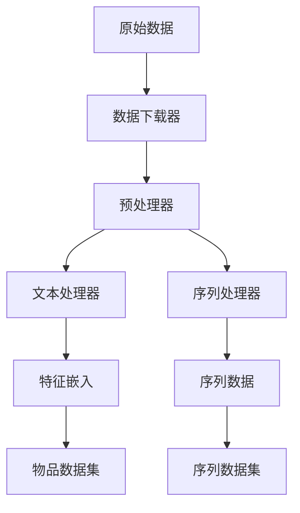

# 数据集概述

genrec 框架支持多种推荐系统数据集，并提供了灵活的数据处理管道。

## 支持的数据集

### P5 Amazon 数据集

P5 Amazon 是一个大规模的产品推荐数据集，包含用户评论和产品元数据。

**特点:**
- 多个产品类别（美容、电子产品等）
- 丰富的文本信息（标题、品牌、类别、价格）
- 用户交互序列数据
- 自动下载和预处理

**使用方法:**
```python
from genrec.data.p5_amazon import P5AmazonItemDataset

dataset = P5AmazonItemDataset(
    root="dataset/amazon",
    split="beauty",
    train_test_split="train"
)
```

## 数据处理架构

### 模块化设计



### 配置系统

使用配置类管理数据处理参数：

```python
from genrec.data.configs import P5AmazonConfig, TextEncodingConfig

config = P5AmazonConfig(
    root_dir="dataset/amazon",
    split="beauty",
    text_config=TextEncodingConfig(
        encoder_model="sentence-transformers/sentence-t5-xl",
        template="Title: {title}; Brand: {brand}"
    )
)
```

## 数据处理流水线

### 1. 数据下载
- 自动从云端下载数据集
- 解压和文件组织
- 验证数据完整性

### 2. 预处理
- 数据清洗和标准化
- 缺失值处理
- ID 映射和重编码

### 3. 特征提取
- 文本特征编码
- 类别特征处理
- 数值特征标准化

### 4. 序列生成
- 用户交互序列构建
- 时序分割（训练/验证/测试）
- 序列填充和截断

## 自定义数据集

要添加新的数据集，需要继承基类并实现必要方法：

```python
from genrec.data.base_dataset import BaseRecommenderDataset

class MyDataset(BaseRecommenderDataset):
    def download(self):
        # 实现数据下载逻辑
        pass
        
    def load_raw_data(self):
        # 加载原始数据
        return {"items": items_df, "interactions": interactions_df}
        
    def preprocess_data(self, raw_data):
        # 数据预处理
        return processed_data
        
    def extract_items(self, processed_data):
        return processed_data["items"]
        
    def extract_interactions(self, processed_data):
        return processed_data["interactions"]
```

## 性能优化

### 缓存机制
- 文本编码结果缓存
- 预处理数据缓存  
- 智能缓存失效

### 内存管理
- 懒加载大型数据集
- 批量数据处理
- 内存使用监控

### 并行处理
- 多进程数据加载
- 并行文本编码
- 分布式预处理

## 最佳实践

1. **数据验证**: 始终验证数据质量和完整性
2. **版本控制**: 跟踪数据集版本和变更
3. **文档记录**: 详细记录数据处理步骤
4. **性能监控**: 监控数据加载和处理性能

## 常见问题

**Q: 如何处理大规模数据集？**
A: 使用分块加载、缓存和并行处理

**Q: 如何添加新的文本编码器？**
A: 继承 TextProcessor 类并实现自定义编码逻辑

**Q: 如何处理不同格式的数据？**
A: 创建自定义数据加载器和预处理管道