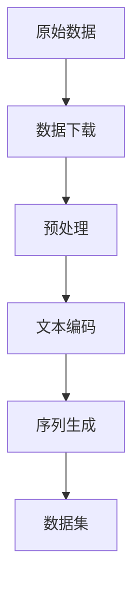
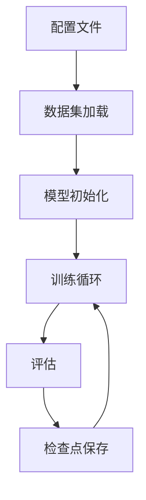

# 快速开始

本指南将帮助您快速上手 genrec 框架。

## 前置要求

- Python 3.8 或更高版本
- CUDA 11.0+ (如果使用 GPU)
- 8GB+ GPU 显存（推荐）

## 安装

### 1. 克隆仓库

```bash
git clone https://github.com/phonism/genrec.git
cd genrec
```

### 2. 安装依赖

```bash
pip install -r requirements.txt
```

### 3. 准备数据

下载 P5 Amazon 数据集：

```bash
# 数据会自动下载到 dataset/amazon 目录
mkdir -p dataset/amazon
```

## 第一个实验：训练 RQVAE

### 1. 查看配置文件

```bash
cat config/rqvae/p5_amazon.gin
```

主要配置参数：
- `train.iterations=400000`: 训练迭代次数
- `train.batch_size=64`: 批量大小
- `train.learning_rate=0.0005`: 学习率
- `train.dataset_folder="dataset/amazon"`: 数据集路径

### 2. 开始训练

```bash
python genrec/trainers/rqvae_trainer.py config/rqvae/p5_amazon.gin
```

训练过程中您会看到：
- 自动数据下载和预处理
- 文本特征编码进度
- 训练损失和指标
- 模型检查点保存

### 3. 监控训练

如果启用了 Weights & Biases 日志：

```bash
# 在配置文件中设置
train.wandb_logging=True
train.wandb_project="your_project_name"
```

访问 [wandb.ai](https://wandb.ai) 查看训练进度。

## 第二个实验：训练 TIGER

### 1. 确保 RQVAE 已训练

TIGER 需要预训练的 RQVAE 模型来生成语义 ID：

```bash
# 检查 RQVAE 检查点是否存在
ls out/rqvae/p5_amazon/beauty/checkpoint_*.pt
```

### 2. 配置 TIGER

编辑 `config/tiger/p5_amazon.gin`：

```gin
train.pretrained_rqvae_path="./out/rqvae/p5_amazon/beauty/checkpoint_299999.pt"
```

### 3. 开始训练

```bash
python genrec/trainers/tiger_trainer.py config/tiger/p5_amazon.gin
```

## 理解框架结构

### 数据处理流水线



### 模型训练流程



## 自定义配置

### 创建自定义配置

```gin
# my_config.gin
import genrec.data.p5_amazon
import genrec.models.rqvae

# 自定义参数
train.batch_size=32
train.learning_rate=0.001
train.vae_hidden_dims=[256, 128, 64]

# 使用自定义数据路径
train.dataset_folder="path/to/my/data"
```

### 使用自定义配置

```bash
python genrec/trainers/rqvae_trainer.py my_config.gin
```

## 评估模型

### RQVAE 评估

```python
from genrec.models.rqvae import RqVae
from genrec.data.p5_amazon import P5AmazonItemDataset

# 加载模型
model = RqVae.load_from_checkpoint("path/to/checkpoint.pt")

# 加载测试数据
test_dataset = P5AmazonItemDataset(
    root="dataset/amazon", 
    train_test_split="eval"
)

# 评估重构质量
reconstruction_loss = model.evaluate(test_dataset)
```

### TIGER 评估

```python
from genrec.models.tiger import Tiger
from genrec.modules.metrics import TopKAccumulator

# 加载模型
model = Tiger.load_from_checkpoint("path/to/checkpoint.pt")

# 计算 Recall@K
metrics = TopKAccumulator(k=10)
recall = metrics.compute_recall(model, test_dataloader)
```

## 常见问题

### Q: 内存不足怎么办？

A: 调整以下参数：
```gin
train.batch_size=16  # 减小批量大小
train.vae_hidden_dims=[256, 128]  # 减小模型规模
```

### Q: 训练速度慢？

A: 优化建议：
- 使用更大的批量大小
- 启用混合精度训练
- 使用多 GPU 训练

### Q: 如何添加新数据集？

A: 参考[自定义数据集指南](dataset/custom.md)

## 下一步

- 了解[模型架构](models/rqvae.md)
- 学习[数据集处理](dataset/overview.md)
- 查看[API 文档](api/index.md)
- 探索[高级示例](examples.md)