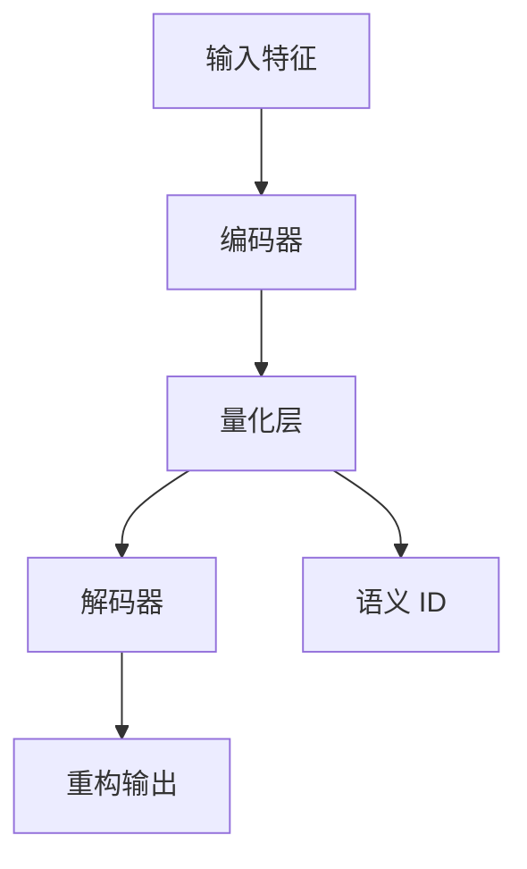

# RQVAE 模型

RQVAE (Residual Quantized Variational Autoencoder) 是一种基于向量量化的变分自编码器，专门用于推荐系统中的物品表示学习。

## 模型架构

### 核心组件



### 编码器 (Encoder)

编码器将原始物品特征（如文本嵌入）映射到潜在空间：

```python
class Encoder(nn.Module):
    def __init__(self, input_dim, hidden_dims, embed_dim):
        self.layers = nn.ModuleList([
            nn.Linear(input_dim, hidden_dims[0]),
            *[nn.Linear(hidden_dims[i], hidden_dims[i+1]) 
              for i in range(len(hidden_dims)-1)],
            nn.Linear(hidden_dims[-1], embed_dim)
        ])
    
    def forward(self, x):
        for layer in self.layers[:-1]:
            x = F.relu(layer(x))
        return self.layers[-1](x)
```

### 量化层 (Quantization)

量化层是 RQVAE 的核心，将连续的嵌入向量映射到离散的码本：

#### 支持的量化策略

1. **Gumbel-Softmax**: 可微分的离散化
2. **STE (Straight-Through Estimator)**: 直通估计器
3. **Rotation Trick**: 旋转技巧
4. **Sinkhorn**: Sinkhorn 迭代算法

```python
@gin.constants_from_enum
class QuantizeForwardMode(Enum):
    GUMBEL_SOFTMAX = 1
    STE = 2
    ROTATION_TRICK = 3
    SINKHORN = 4
```

### 解码器 (Decoder)

解码器将量化后的表示重构回原始特征空间：

```python
class Decoder(nn.Module):
    def __init__(self, embed_dim, hidden_dims, output_dim):
        reversed_dims = list(reversed(hidden_dims))
        self.layers = nn.ModuleList([
            nn.Linear(embed_dim, reversed_dims[0]),
            *[nn.Linear(reversed_dims[i], reversed_dims[i+1]) 
              for i in range(len(reversed_dims)-1)],
            nn.Linear(reversed_dims[-1], output_dim)
        ])
    
    def forward(self, x):
        for layer in self.layers[:-1]:
            x = F.relu(layer(x))
        return self.layers[-1](x)
```

## 训练过程

### 损失函数

RQVAE 的训练目标包含三个部分：

1. **重构损失** (Reconstruction Loss)
2. **量化损失** (Quantization Loss)  
3. **承诺损失** (Commitment Loss)

```python
total_loss = reconstruction_loss + β * quantization_loss + γ * commitment_loss
```

### 配置参数

```gin
# 模型架构
train.vae_input_dim=768        # 输入特征维度
train.vae_embed_dim=32         # 嵌入维度
train.vae_hidden_dims=[512, 256, 128]  # 隐藏层维度
train.vae_codebook_size=256    # 码本大小
train.vae_n_layers=3           # 量化层数

# 量化设置
train.vae_codebook_mode=%genrec.models.rqvae.QuantizeForwardMode.ROTATION_TRICK
train.vae_codebook_normalize=False
train.vae_sim_vq=False

# 损失权重
train.commitment_weight=0.25   # 承诺损失权重
```

## 使用方法

### 创建模型

```python
from genrec.models.rqvae import RqVae, QuantizeForwardMode

model = RqVae(
    input_dim=768,
    embed_dim=32,
    hidden_dims=[512, 256, 128],
    codebook_size=256,
    codebook_normalize=False,
    codebook_sim_vq=False,
    n_layers=3,
    n_cat_features=0,
    commitment_weight=0.25,
    codebook_mode=QuantizeForwardMode.ROTATION_TRICK
)
```

### 训练模型

```python
from genrec.data.p5_amazon import P5AmazonItemDataset
from torch.utils.data import DataLoader

# 创建数据集
dataset = P5AmazonItemDataset(
    root="dataset/amazon",
    split="beauty",
    train_test_split="train"
)

# 创建数据加载器
dataloader = DataLoader(dataset, batch_size=64, shuffle=True)

# 训练循环
optimizer = torch.optim.AdamW(model.parameters(), lr=0.0005)

for epoch in range(num_epochs):
    for batch in dataloader:
        optimizer.zero_grad()
        
        # 前向传播
        outputs = model(batch)
        loss = outputs.loss
        
        # 反向传播
        loss.backward()
        optimizer.step()
```

### 生成语义 ID

```python
# 加载训练好的模型
model = RqVae.load_from_checkpoint("checkpoint.pt")
model.eval()

# 生成语义 ID
with torch.no_grad():
    semantic_ids = model.get_semantic_ids(item_features)
    print(f"Semantic IDs shape: {semantic_ids.shape}")
```

## 评估指标 {#评估指标}

### 重构质量

```python
def evaluate_reconstruction(model, test_dataloader):
    model.eval()
    total_loss = 0
    num_samples = 0
    
    with torch.no_grad():
        for batch in test_dataloader:
            outputs = model(batch)
            total_loss += outputs.reconstruction_loss.item() * len(batch)
            num_samples += len(batch)
    
    return total_loss / num_samples
```

### 码本利用率

```python
def compute_codebook_usage(model, dataloader):
    model.eval()
    used_codes = set()
    
    with torch.no_grad():
        for batch in dataloader:
            semantic_ids = model.get_semantic_ids(batch)
            used_codes.update(semantic_ids.flatten().tolist())
    
    usage_rate = len(used_codes) / model.codebook_size
    return usage_rate
```

## 最佳实践

### 超参数调优

1. **学习率**: 从 0.0005 开始，根据训练稳定性调整
2. **批量大小**: 64-128 通常效果较好
3. **码本大小**: 256-512，取决于数据复杂度
4. **承诺权重**: 0.25 是一个好的起始点

### 训练技巧

1. **预训练**: 可以先用较大学习率进行预训练
2. **学习率调度**: 使用余弦退火或阶梯式衰减
3. **早停**: 监控验证集重构损失进行早停
4. **正则化**: 适当的权重衰减防止过拟合

### 常见问题

**Q: 码本崩塌怎么办？**
A: 
- 增加 commitment_weight
- 使用 ROTATION_TRICK 模式
- 调整学习率

**Q: 重构质量差？**
A: 
- 增加模型容量 (hidden_dims)
- 调整量化策略
- 检查数据预处理

## 扩展功能

### 多层量化

```python
# 支持多层量化以获得更好的表示能力
train.vae_n_layers=3  # 使用 3 层量化
```

### 自定义损失

```python
class CustomRqVae(RqVae):
    def compute_loss(self, x, outputs):
        # 基础损失
        base_loss = super().compute_loss(x, outputs)
        
        # 添加自定义正则化
        regularization = self.custom_regularization(outputs)
        
        return base_loss + regularization
```

## 相关论文

- [RQ-VAE Recommender](https://github.com/EdoardoBotta/RQ-VAE-Recommender)
- [Adapting Large Language Models by Integrating Collaborative Semantics for Recommendation](https://arxiv.org/pdf/2311.09049)